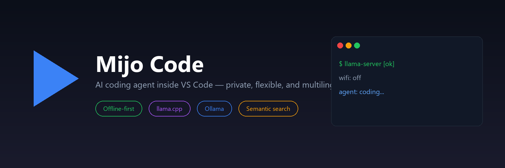
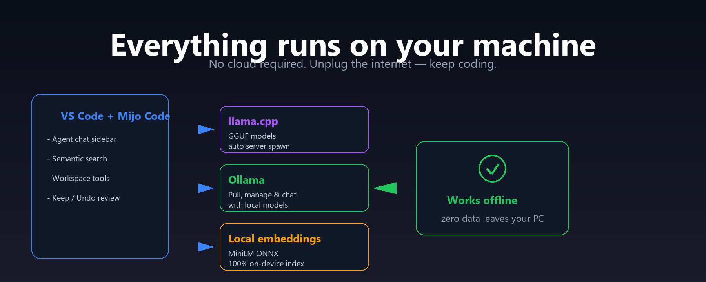
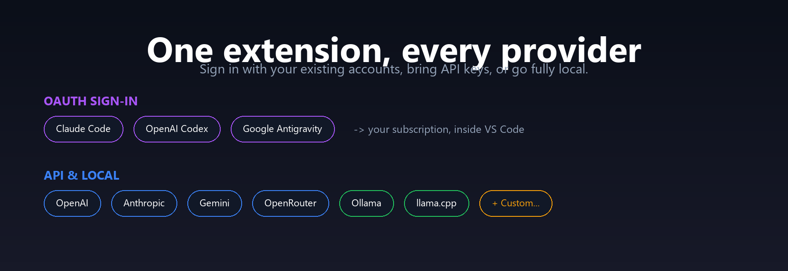
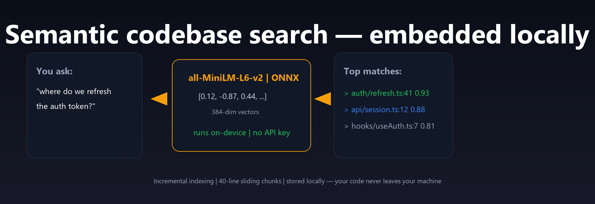

---

## What is Mijo Code?

**Mijo Code** is an AI coding agent that lives inside VS Code. It reads your workspace, answers questions, edits files, runs terminal commands, and searches your codebase by meaning — all from a sidebar chat.

Use it with your existing AI subscriptions, API keys, or run it **completely offline** with local models.

---

## Install

1. Open **VS Code**.
2. Go to **Extensions** (`Ctrl+Shift+X`).
3. Search for **Mijo Code**.
4. Click **Install**.

Or install directly from the [Visual Studio Marketplace](https://marketplace.visualstudio.com/items?itemName=MijoCodeExtension.mijo-code).

---

## Get started in 30 seconds

1. Open the **Mijo Code** sidebar from the Activity Bar.
2. Pick a provider:
   - **Local:** download a GGUF model or connect to Ollama.
   - **OAuth:** sign in with Claude Code, OpenAI Codex, or Google Antigravity.
   - **API:** paste your key for OpenAI, Anthropic, Gemini, OpenRouter, or a custom endpoint.
3. Start typing. Press `Ctrl + L` (`Cmd + L` on macOS) to add your current code selection to the chat.

---

## What you can do

| | |
|---|---|
| 💬 **Chat with your codebase** | Ask questions, get explanations, and iterate in multi-turn conversations. |
| 🔍 **Semantic search** | Find code by meaning, not just keywords, using a local embedding model. |
| 🛠️ **Edit files** | The agent can read, write, and patch files in your workspace. |
| ✅ **Review every change** | Keep or undo each edit with inline CodeLenses — no git required. |
| 🖥️ **Run commands** | Let the agent run shell commands and see the output in context. |
| 🌐 **Search the web** | Bring live documentation and references into the conversation. |
| 🔗 **MCP tools** | Connect external services through Model Context Protocol servers. |
| 🎭 **Personas** | Switch personalities and system prompts for different tasks. |
| 🌙 **Dark mode ready** | UI designed to match the VS Code look and feel. |
| 🌐 **English / Español** | Switch the interface language from Settings. |

---

## Works offline

Mijo Code is built to respect your privacy:

- **llama.cpp** — run GGUF models locally, auto-managed server.
- **Ollama** — pull and chat with local models, zero config.
- **Local embeddings** — semantic search powered by on-device ONNX MiniLM.
- **No cloud required** — once set up, everything runs on your machine.

---

## Bring your own provider

- **OAuth:** Claude Code · OpenAI Codex · Google Antigravity
- **API keys:** OpenAI · Anthropic · Gemini · OpenRouter · Custom endpoints
- **Local:** Ollama · llama.cpp

---

## Find code by meaning

Ask *"where do we refresh the auth token?"* and Mijo Code finds the relevant files by semantic similarity. The index builds automatically, updates incrementally, and stays on your device.

---

## Settings

Open VS Code Settings (`Ctrl+,`) and search for **Mijo Code** to customize:

- Default model and provider
- System prompt / persona
- Language: English or Español
- Approval policy for risky actions
- Workspace context and file-reading behavior
- Maximum response length

---

## Support

Questions, bugs, or feature requests? Open an issue on GitHub:

**https://github.com/FaidersAltamar/Mijo-Code-Extension/issues**

---

## License

[MIT](LICENSE)
